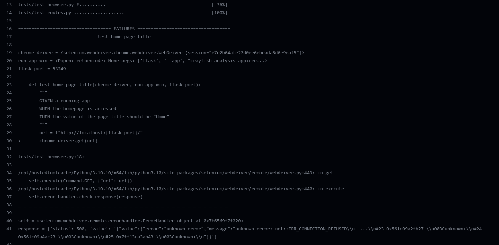
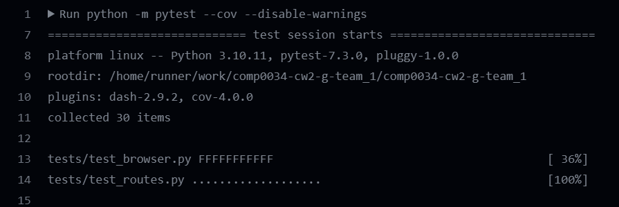
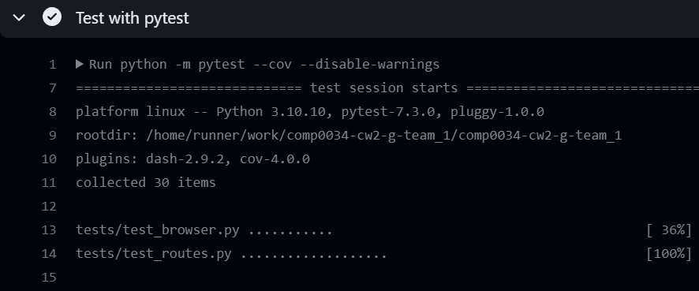
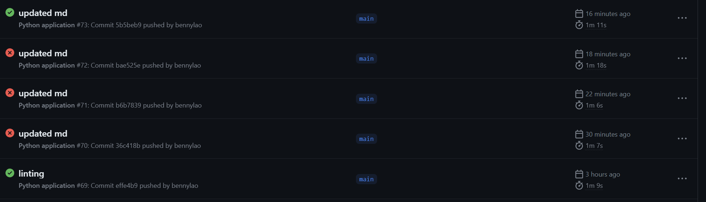

# Read Me

## Link to Repository
https://github.com/ucl-comp0035/comp0034-cw2-g-team_1.git

### Password Reset Link Feature with token
Followed an online tutorial by Corey Schafer titled "Python Flask Tutorial: Full-Featured Web App Part 10 - Email and Password Reset".
https://www.youtube.com/watch?v=vutyTx7IaAI&t=361s

## Set Up Instruction
```
pip install -r requirements.txt
pip install e .
```
## Run Pytest
```
pytest
```


## Run Coverage
```
pytest --cov 
```
 

## Import Data from csv to database
```
python data/excel_to_db.py
```


## Test Reports
*insert screenshot*


## Coverage Report
*insert screenshot*


## Unexpected Error Occurred on GitHub Continuous Integration
Although all the tests passed on a local computer (CI 1), sometimes the first test on GitHub action will fail with an 
unknown error. The error occurred from the command ```chrome_driver.get(url)``` (see CI 2 and CI 3).

### CI 1 (Screenshot from PyCharm)


### CI 2


### CI 3


However, this issue can be somehow resolved by performing the following actions.

1) Put ```scope=session``` for fixture ```chrome_driver``` in ```conftest.py```
```
### conftest.py
@pytest.fixture(scope="session")
def chrome_driver():
    """Selenium webdriver with options to support running in GitHub actions
    Note:
        For CI: headless not commented out
        For running on your computer: headless to be commented out
    """
    options = Options()
    options.add_argument("--headless")
    options.add_argument("--window-size=1920,1080")
    driver = Chrome(options=options)
    driver.maximize_window()
    yield driver
    driver.quit()
```
2) Commit it to GitHub
3) You should see all the tests related to Selenium are failing

4) Put ```scope=class``` back to the fixture ```chrome_driver``` in ```conftest.py```
```
### conftest.py
@pytest.fixture(scope="class")
def chrome_driver():
    """Selenium webdriver with options to support running in GitHub actions
    Note:
        For CI: headless not commented out
        For running on your computer: headless to be commented out
    """
    options = Options()
    options.add_argument("--headless")
    options.add_argument("--window-size=1920,1080")
    driver = Chrome(options=options)
    driver.maximize_window()
    yield driver
    driver.quit()
```
5) Commit it back to GitHub
6) All the tests should be passed

7) However, the second time of committing the exactly same repository will fail with the unknown error again.

8) Evidence of performing this can be found from GitHub Action from #69 to #73.

