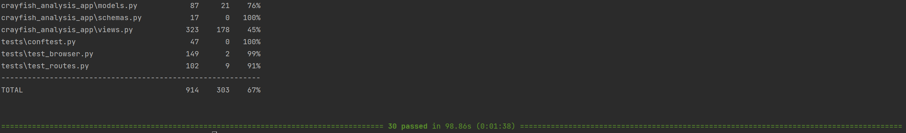

# Read Me

### Link to Repository
https://github.com/ucl-comp0035/comp0034-cw2-g-team_1.git

### Password Reset Link Feature with token
Followed an online tutorial by Corey Schafer titled "Python Flask Tutorial: Full-Featured Web App Part 10 - Email and Password Reset".
https://www.youtube.com/watch?v=vutyTx7IaAI&t=361s

### Set Up Instruction
```
pip install -r requirements.txt
pip install e .
```
### Run Pytest
```
pytest
```


### Run Coverage
```
pytest --cov 
```
 

### Import Data from csv to database
```
python data/excel_to_db.py
```


### Test Reports
*insert screenshot*


### Coverage Report
*insert screenshot*


### Unexpected Error Occurred on GitHub Continuous Integration
Although all the tests passed on a local computer, sometimes the first tests will fail without unknown error.
