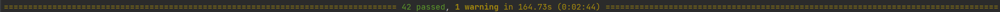

# Read Me

## Link to Repository
https://github.com/ucl-comp0035/comp0034-cw2-g-team_1.git


## Set Up Instruction
```shell
pip install -r requirements.txt
pip install -e .
```

## To Run the Flask App
```shell
python -m flask --app "crayfish_analysis_app:create_app('config.DevelopmentConfig')" --debug run
```
The flask app should be running on http://127.0.0.1:5000.

## Import Excel to Database
If the tables named "crayfish1" and "crayfish2" in database.db are empty or there is no data list shown in the route 
```/crayfish1``` and ```/crayfish2```, the following command should be executed once 
to import the data from the Excel file to the database. *Note that this command should not be run twice,
otherwise the data in the database will be duplicated.*
```shell
python data/excel_to_db.py
```

## Run Pytest
```shell
pytest
```

## Run Coverage
```shell
pytest --cov 
```

## Test Reports

