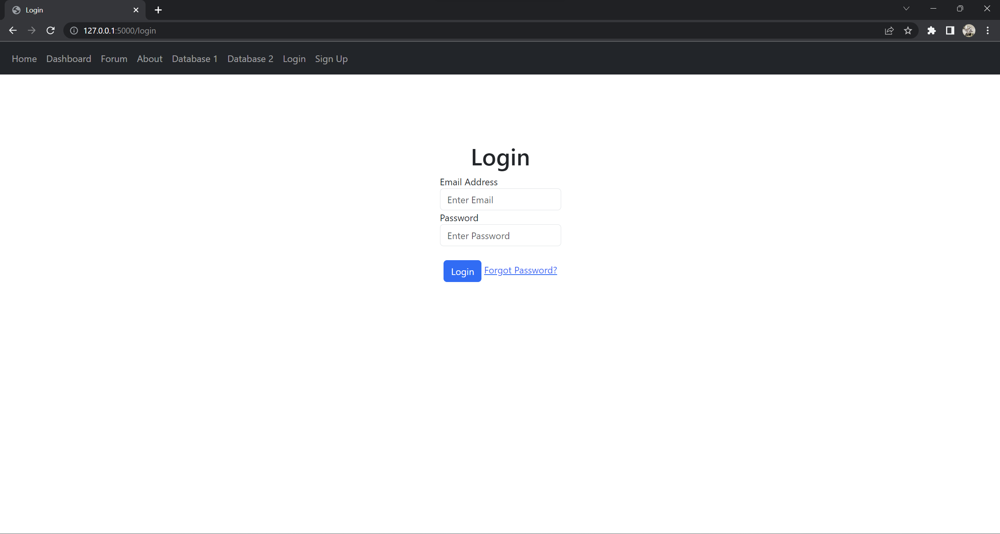

# Read Me

## Link to Repository
https://github.com/ucl-comp0035/comp0034-cw2-g-team_1.git


## Set Up Instruction
```
pip install -r requirements.txt
pip install -e .
```


## To Run the flask app
```
python -m flask --app "crayfish_analysis_app:create_app('config.DevelopmentConfig')" --debug run
```
The flask app should be running on http://127.0.0.1:5000.


## Import excel to database
If the tables named "crayfish1" and "crayfish2" in database.db are empty or there is no data list shown in the route 
```/crayfish1``` and ```/crayfish2```, the following command should be executed once 
to import the data from the Excel file to the database. *Note that this command should not be run twice,
otherwise the data in the database will be duplicated.*
```
python data/excel_to_db.py
```


## Run Pytest
```
pytest
```


## Run Coverage
```
pytest --cov 
```


## Test Reports
*!!!!!!!!!!!!!!!!!!!!!!!!!!!!!!insert screenshot!!!!!!!!!!!!!!!!!!!!!!!!!!!!*


## Coverage Report
The coverage for ```dash_app\app.py``` is low because the dash app has already been tested in the previous coursework.
As we don't want to include too many repeated codes from the previous coursework, the testing codes for the dash app are
not put in this repository. The helper function ```read_excel_multi_index``` is also not tested as it has already been
tested in the COMP0035 coursework 1.

*However, it is worth noting that the layout of the dash app has been modified a bit.
User can now return to the flask app (i.e., homepage, forum page, etc.) from the dash app.*

*!!!!!!!!!!!!!!!!!!!insert screenshot!!!!!!!!!!!!!!!!!!!!*


# Good to mention
## Forgot Password

### Forum Functionality

This extra feature was added by following an online tutorial by *Tech With Tim*.
https://www.youtube.com/watch?v=GQcM8wdduLI


### Password Reset Link Feature with token
Followed an online tutorial by Corey Schafer titled "Python Flask Tutorial: 
Full-Featured Web App Part 10 - Email and Password Reset".
https://www.youtube.com/watch?v=vutyTx7IaAI&t=361s

Forgot Password is developed. In order to have a try of this feature, you will have to create a new account with 
your actual email in the signup page. Then logout and come back to login page and press the button 'Forgot Password?'
An email from "ranaprasen24@gmail.com" will be sent to you shortly for resetting the password, 
sometimes it might be in the spam so please check your email carefully.


## Error Handler for flask app
Error page for response code 404 is developed, user will be redirected to this error page while 
the user is accessing a route that does not exist.


## Download Database
In the routes ```/crayfish1``` and ```/crayfish2```, there is a button for downloading the data in Table "crayfish1" 
and "crayfish2". With this feature, the data in Table "crayfish1" or "crayfish2" will be written into a csv file and 
the csv file will be downloaded to your computer. The downloaded csv file samples are put in the directory 
```Sample_db_download``` as an evidence in case this feature doesn't work.


# Errors
## Unexpected Error Occurred on GitHub Continuous Integration
Although all the tests passed on a local computer (CI 1), sometimes the first test on GitHub action will fail with an 
unknown error. The error occurred from the command ```chrome_driver.get(url)``` (see CI 2 and CI 3).

### CI 1 (Screenshot from PyCharm)


### CI 2


### CI 3


However, this issue can be somehow resolved by performing the following actions.

1) Put ```scope=session``` for fixture ```chrome_driver``` in ```conftest.py```
```
### conftest.py
@pytest.fixture(scope="session")
def chrome_driver():
    """Selenium webdriver with options to support running in GitHub actions
    Note:
        For CI: headless not commented out
        For running on your computer: headless to be commented out
    """
    options = Options()
    options.add_argument("--headless")
    options.add_argument("--window-size=1920,1080")
    driver = Chrome(options=options)
    driver.maximize_window()
    yield driver
    driver.quit()
```
2) Commit it to GitHub
3) You should see all the tests related to Selenium are failing

4) Put ```scope=class``` back to the fixture ```chrome_driver``` in ```conftest.py```
```
### conftest.py
@pytest.fixture(scope="class")
def chrome_driver():
    """Selenium webdriver with options to support running in GitHub actions
    Note:
        For CI: headless not commented out
        For running on your computer: headless to be commented out
    """
    options = Options()
    options.add_argument("--headless")
    options.add_argument("--window-size=1920,1080")
    driver = Chrome(options=options)
    driver.maximize_window()
    yield driver
    driver.quit()
```
5) Commit it back to GitHub
6) All the tests should be passed

7) However, the second time of committing the exactly same repository will fail with the unknown error again.
8) Evidence of performing this can be found from GitHub Action from #69 to #73.

9) This error can also be proven from GitHub Actions #79 and #80 where the only difference between these two versions is
a line in ```README.md```.